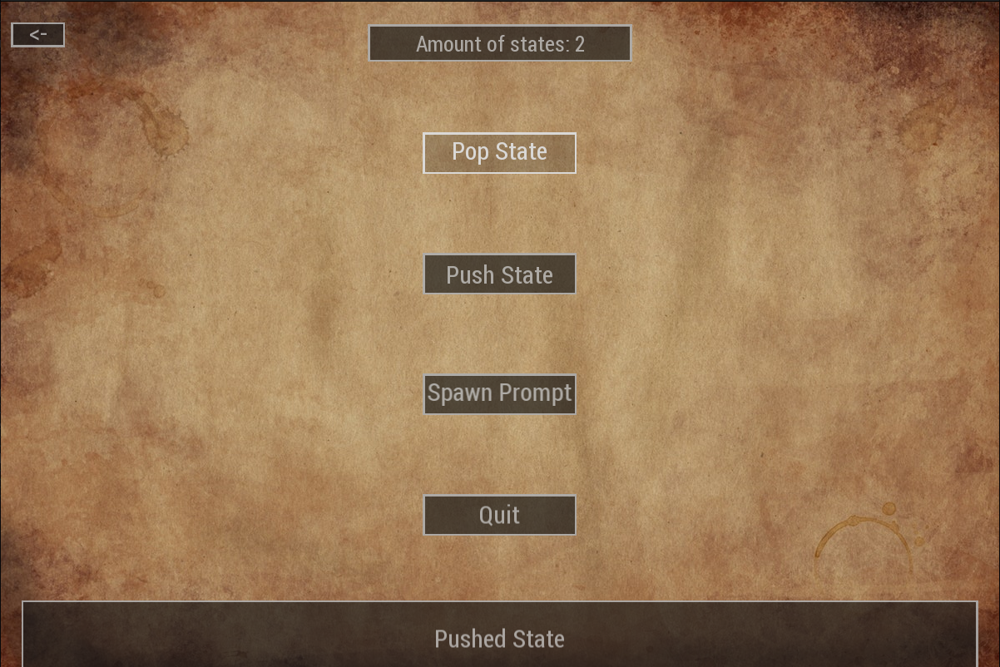
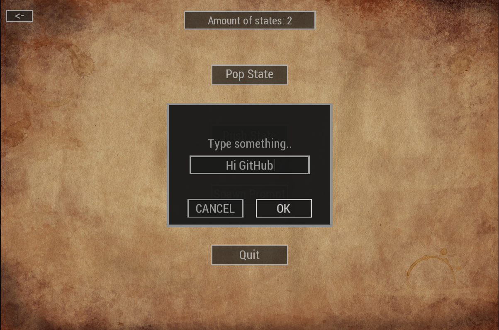

# skeleton
## Simple 2D application framework written in C++/SFML. 

**Skeleton** is a simple framework for creating apps and games using C++ and SFML. It has some tools that make creating new projects easier and faster. It comes with built-in classes such as Buttons, Popups, ResourceManager etc. so you can focus on other aspects of creating your app and stop worrying about creating GUI components or playing sounds - **Skeleton has it all!**

### Brief overview of Skeleton's modules and most important classes
- **GUI** - Contains all GUI based components
  - **Text** - Basic sf::Text wrapper with some more functionallity
  - **Box** - Basic sf::RectangleShape wrapper with some more functionallity
  - **TextBox** - Combination of Text and Box classes
  - **Button** - A clickable TextBox with callback
  - **InputBox** - A box which handles user's input
  - **Popup** - Can be used as an notifiaction
  - **Prompt** - Contains InputBox and Buttons and can act as a prompt window
- **States** - Contains State interface which is used with StateManager
  - **FrameworkSplashscreen** - an example of state that implements State interface
- **Managers** - All classes that help with managing the framework resources, states etc.
  - **CacheSystem** - Manages loading and caching resources such as sf::Texture, sf::SoundBuffer etc.
  - **AudioProvider** - Uses CacheSystem to play music and sounds (defalut implementation is SFMLSoundProvider)
  - **StateManager** - Manages State classes. Lets push new States and updates the current state
  - **ButtonManager** - Manages laying out the buttons, put's them in groups which results in nicely handled keyboard navigation
  - **bunch** of other Manager classes
- **Util**
  - **Animation** - (*work in progress*) Handles animating of GUI components
  - **Random** - Random integer/float distribution with range
  - **FPSCounter** - Useful utility to check the performance
  - **Math** - Some basic functions that I found helpful in creating SFML apps
- **Application** - Handles running the app, updating all managers, changing backgrounds etc.

## Example screenshots:
Here are example screenshots of the Sandbox app using Skeleton framework

### Main menu

### Handling user input


# How to build

## CMake
Download [SFML](https://www.sfml-dev.org/download/sfml/2.5.1/) compatible with your compiler and extract it to folder
in the project or use your package manager to download the library.

## Linux
Root project Makefile takes care of building the project. It accepts two flags that are passed to CMake.
* `CMAKE_BUILD_TYPE` - the build type. If not specified `Debug` is used.
* `SFML_DIR` - CMake configuration path. This should be used when SFML was installed manually to tell `find_package` where
to search SFML for.
### Example: Linux with defualt parameters
```
make
cd build/
./Sandbox
```

### Example: Linux with non default parameters
This shows `CMAKE_BUILD_TYPE` and `SFML_DIR` passed as parameters. This assumes SFML was downloaded and extracted in
`vendor` folder.
```
make CMAKE_BUILD_TYPE=Release SFML_DIR=vendor/SFML-2.5.1/lib/cmake/SFML
cd build/
./Sandbox
```

## Windows
### Example: Windows Visual Studio
CMake should take care of creating the solution files. As this example does not use Makefile, you need to pass the
`SFML_DIR` parameter directly to CMake:
```
mkdir build
cd build
cmake -DSFML_DIR=vendor\SFML-2.5.1\lib\cmake\SFML ..
```
After that open generated solution file and hit build.

### Example: Windows MinGW Makefiles
This works similiar to the previous example but uses different generator.
```
mkdir build
cd build
cmake -G "MinGW Makefiles" -DSFML_DIR=vendor\SFML-2.5.1\lib\cmake\SFML ..
make
# run the app after copying dll files
Sandbox.exe
```

### Tested on:
* Ubuntu using libsfml-dev package. This is also used for CI builds.
* Arch using sfml package.
* Windows using Visual Studio 2019 with SFML for Visual Studio 2015 32-bit version.
* Windows using MinGW Makefiles with SFML for GCC 7.3.0 32-bit version.

## Skeleton used in other projects:
* [szykol/Tetris](https://github.com/szykol/Tetris) - simple tetris game that uses Skeleton to manage the game state
and menus.

## Skeleton used to be built with premake5:
As skeleton supports the CMake build system which goes along SFML, which also uses CMake, I'd encourage to use
the build options explained above.

#### Anyway, here are notes on building Skeleton with premake5:

Download [SFML](https://www.sfml-dev.org/download/sfml/2.5.1/) and extract it to the *vendor/SFML* folder.

Download [premake5](https://premake.github.io/download.html) and remember it's location or add it to path

### Example: Generating Visual Studio 2019 solution and project files
```
path/to/premake5.exe vs2019
# or if the path to SFML is different than default
path/to/premake5.exe --sfmlpath=path/to/SFML vs2019
```
Then compile it and run with Visual Studio

### Example: Generating Makefiles
```
path/to/premake5.exe gmake2
# or if the path to SFML is different than default
path/to/premake5.exe --sfmlpath=path/to/SFML gmake2
```

After that
```
make
# after sucessful compilation
cd Sandbox
# it needs to be run from the projects root directory for now
..\bin\Debug-windows-x86\Sandbox\Sandbox.exe
```

Keep in mind that path to the downloaded SFML **must be** relative to the premake5.lua script

### Other platforms and project files
For generating other project files or for different platforms head to this [link](https://github.com/premake/premake-core/wiki/Using-Premake)
